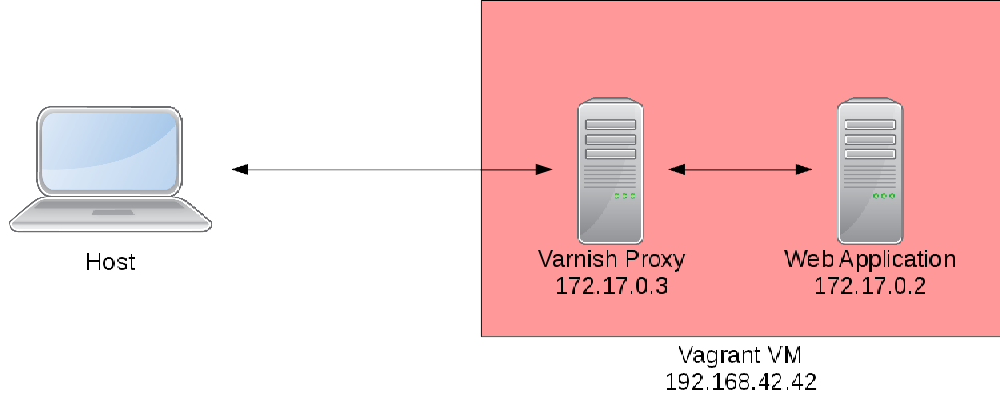

# PRÉSENTATION - WEB CACHING AVEC VARNISH

Ce repository contient une présentation de la suite logicielle
[Varnish Cache](https://varnish-cache.org), ainsi qu'une infrastructure de
démonstration.

## ÉTUDIANTS

* FRANCHINI Fabien ([@crab_one](https://twitter.com/crab_one))
* HENNEBERGER Sébastien ([@Shen299](https://twitter.com/Shen299))
* ROUILLER Bastien

## PRÉSENTATION

Ce repository supporte la fonctionnalité `Github-Pages`. Pour visionner les
slides de la présentation, veuillez vous rendre sur ce 
[lien](https://crabone.github.io/HEIGVD-AIT-2016-Talk-Varnish). 

## DÉMONSTRATION



### INSTALLATION

Pour utiliser l'infrastructure de démonstration, il faut préalablement
installer le logiciel [Vagrant](https://www.vagrantup.com/downloads.html).

**Avertissement**: Pour utiliser l'infrastructure, il est impératif que la
plage ip 192.168.42.0/24 ne soit pas déjà occupée.

```
$ git clone https://github.com/crabone/HEIGVD-AIT-2016-Talk-Varnish/
$ cd ./HEIGVD-AIT-2016-Talk-Varnish/demo
$ vagrant up
```

Ensuite avec un navigateur web se rendre sur
[http://192.168.42.42](http://192.168.42.42).
